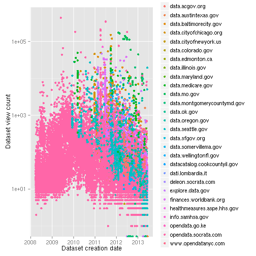

```r
ggplot(socrata) + aes(x = createdAt, y = viewCount, color = portal) + geom_point() + 
    scale_x_date("Dataset creation date") + scale_y_log10("Dataset view count")
```

```
## Warning: Removed 72 rows containing missing values (geom_point).
```

 

